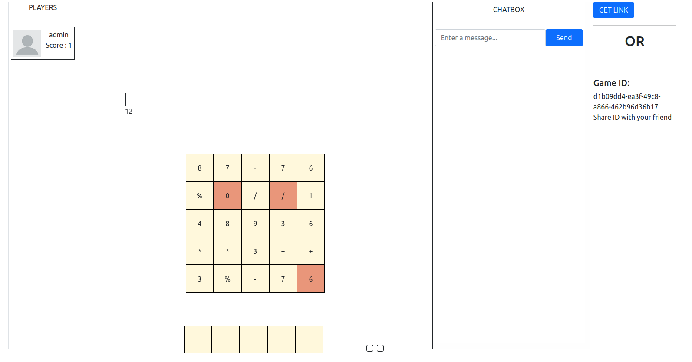
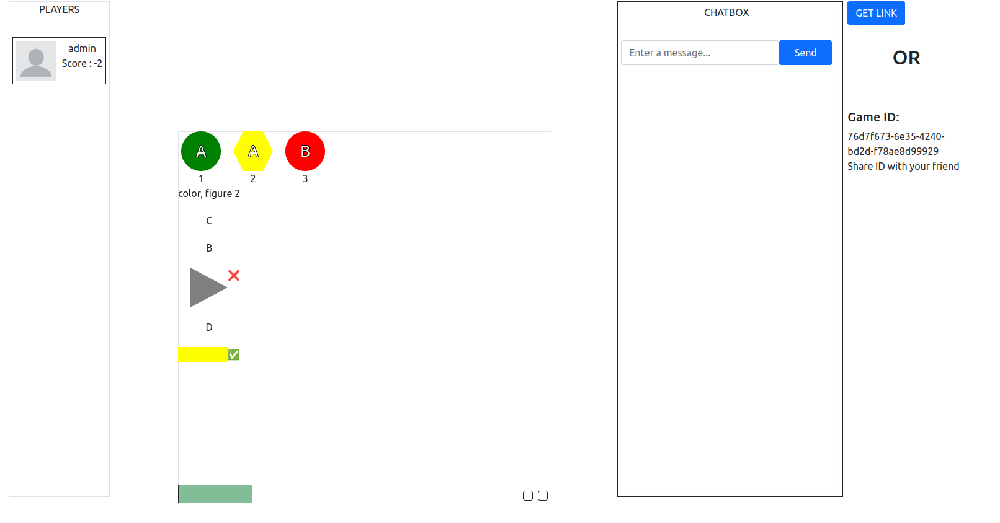
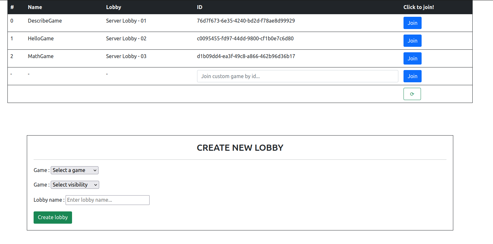
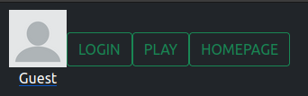
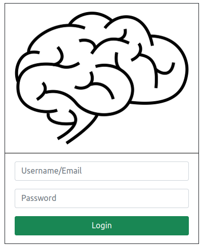

<h3> A website which hosts puzzle games, currently two of them : Math Game and Describe Game
The players can create an account, login, join/create a lobby, invite their friends, and chat with the other players in the same lobby
</h3>
 
<h1>Math Game :</h1>

The player has to select the tiles in order to make the given number. 
For example, as shown above, if the number is 12, the player can select the tiles 6, *, and 2 because 6\*2 = 12. 
The player can also click on the brown tiles in order to put them in their inventory for future use. 
All games are multiplayer, so other players can join, and if another player picks a tile, that tile becomes un-pickable by other players.

 

<h1>Describe Game :</h1>

The player has to remember the color, letter and shape of the figures, and then choose the correct option. 
The player will be asked to choose the characteristic of a particular figure. In the above case, the color of figure 2 was asked. The player selected the wrong option.

 

<h1>Lobby :</h1>

The player can either join a particular lobby, or create their own lobby with the game of their choice along with lobby visibility setting (Private or Public) and lobby name. 
If the lobby is set to Public, other players will see the lobby pop up in the table and can join it using the button

 

<h1>Navigator :</h1>

The player can login, logout, start playing a game, or go back to the homepage if via the navigator bar. Their username and profile picture is also displayed. The navigator bar is present at the top of every page of the website.

 

<h1>Login Page :</h1>

